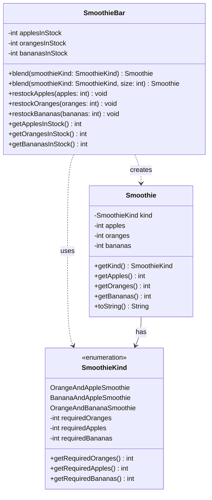

# Smoothie Bar Class Diagram

```mermaid
classDiagram
    class SmoothieBar {
        -int applesInStock
        -int orangesInStock
        -int bananasInStock
        +blend(smoothieKind: SmoothieKind) Smoothie
        +blend(smoothieKind: SmoothieKind, size: int) Smoothie
        +restockApples(apples: int) void
        +restockOranges(oranges: int) void
        +restockBananas(bananas: int) void
        +getApplesInStock() int
        +getOrangesInStock() int
        +getBananasInStock() int
    }

    class Smoothie {
        -SmoothieKind kind
        -int apples
        -int oranges
        -int bananas
        +getKind() SmoothieKind
        +getApples() int
        +getOranges() int
        +getBananas() int
        +toString() String
    }

    class SmoothieKind {
        <<enumeration>>
        OrangeAndAppleSmoothie
        BananaAndAppleSmoothie
        OrangeAndBananaSmoothie
        -int requiredOranges
        -int requiredApples
        -int requiredBananas
        +getRequiredOranges() int
        +getRequiredApples() int
        +getRequiredBananas() int
    }

    SmoothieBar ..> Smoothie : creates
    SmoothieBar ..> SmoothieKind : uses
    Smoothie --> SmoothieKind : has
```
