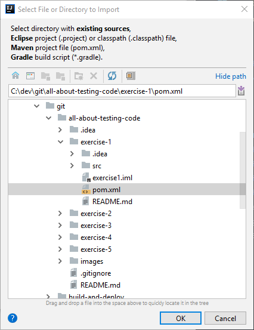
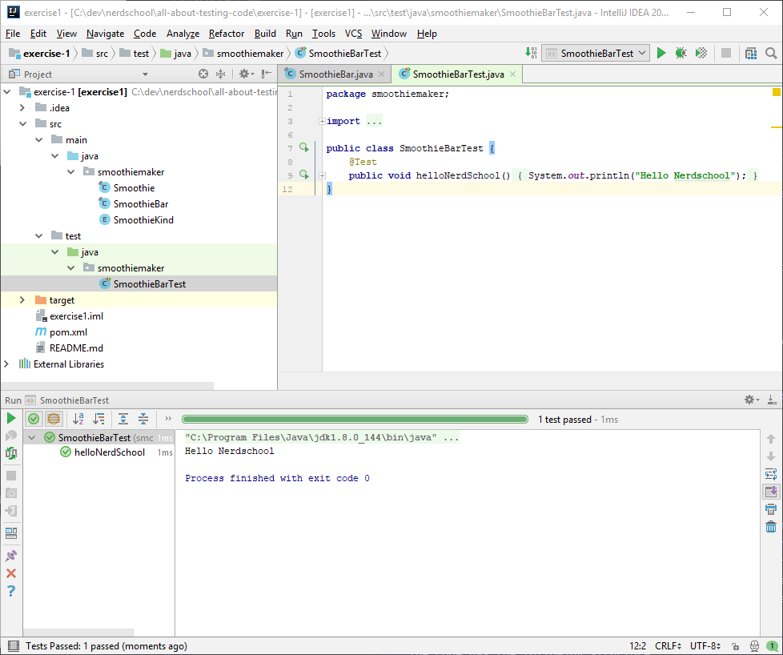
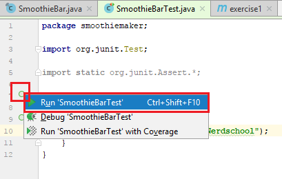

# Exercise 1 - Introduction

This exercise will get you started learning the basics of writing and running some tests in an IDE (Integrated Development Environemnt) using the JUnit testing framework.

We are going to assume you have IntelliJ Community Edition installed.

## You will learn how to:

1. Set up your development environment
2. Create your first unit tests using JUnit
3. Structure your tests properly

## 1.1. Dev environment

> **Before you begin**: Please make sure that you have the following installed:
- IntelliJ Community Edition: [IntelliJ Community Edition](https://www.jetbrains.com/idea/download/)
- Java dev kit: [Java SE Development Kit](https://www.oracle.com/technetwork/java/javase/downloads/index.html)

:pencil2: Start by selecting **"Import Project"** in the Welcome screen:


:pencil2: Then browse to, and select, the `pom.xml` file under the **"exercise-1"** folder.



:pencil2: Then follow the steps, accepting the defaults in all windows.

:pencil2: Make sure you select Java JDK 11 when prompted for project SDK. You might need to browse to the directory where the SDK is installed on your computer.


:pencil2: After finishing the import steps, your project structure should look like the below screenshot. IntelliJ should've picked up that `src/test/java` is a content root for tests and color it light green.



:pencil2: Open the `SmoothieBarTest` file and click the green circle/arrow next to the line numbers. Run the tests for the file.



You should see same test result as the earlier screenshot

```
Hello Nerdschool

Process finished with exit code 0
```

## 1.2. Code example
In the introductory exercises you will be working with a simple, ready made example. The theme / "problem domain" is a smoothie bar that can blend different types of smoothies and keep track of the stock of ingredients. The smoothie bar is pretty limited, as they only use apples, oranges and bananas in smoothies, and can only serve three different kinds of smoothie: "Orange and apple smoothie", "Banana and apple smoothe" and "Orange and banana smoothie".

The code has the following structure:

- A `SmoothieKind` enum having three different enum values: `OrangeAndAppleSmoothie`, `BananaAndAppleSmoothe` and `OrangeAndBananaSmoothie`. Each smoothie has different recipes (how many apples, oranges and bananas required)
- A `Smoothie` representing the beverage that the bar can blend. It has information about what `SmoothieKind` it is, and what ingredients it consists of
- A `SmoothieBar` class representing the smoothie bar. It has these public methods:
  - `blend` - which takes `SmoothieKind` as a parameter and returns a `Smoothie`
  - `getApplesInStock`, `getOrangesInStock` and `getBananasInStock` which gets the current stock of ingredients
  - `restockApples`, `restockOranges` and  `restockBananas` which lets you add ingredients to the stock

We are going to focus on testing the `SmoothieBar`-class in the next exercises.

## 1.3 Creating your first unit tests

Let's start by creating a test that'll test if the `SmoothieBar` class can blend an orange and apple smoothie.

:pencil2: Remove the `helloNerdSchool` test and add the following by writing the code yourself (don't copy & paste):

```java
@Test
public void canBlendOrangeAndAppleSmoothie() {
    SmoothieBar smoothieBar = new SmoothieBar();
    smoothieBar.restockApples(2);
    smoothieBar.restockOranges(2);
    Smoothie smoothie = smoothieBar.blend(SmoothieKind.OrangeAndAppleSmoothie);
    assertTrue(smoothie.getKind() == SmoothieKind.OrangeAndAppleSmoothie);
}
```

:pencil2: Run the test, and see that it passes (marked green in the Test Runner).  
:book: Notice the JUnit `assertTrue` method call. This method tests that the given boolean expression is true. If not, the test fails.  
:pencil2: Make the test fail by making a change to the assertion and re-run the test.  
:book: Observe what happens in the Test Runner.  

The `assertTrue` assertion is one of many built in to the JUnit framework. [More about assertions here](https://github.com/junit-team/junit4/wiki/Assertions).

We also want to test that the `SmoothieBar` class consumes oranges and apples from its stock when a smoothie is made.

:pencil2: Add the following test by writing the code yourself (don't copy & paste):

```java
@Test
public void blendingOrangeAndAppleSmoothieConsumesOrangesAndApples() {
    SmoothieBar smoothieBar = new SmoothieBar();
    smoothieBar.restockApples(2);
    smoothieBar.restockOranges(2);
    Smoothie smoothie = smoothieBar.blend(SmoothieKind.OrangeAndAppleSmoothie);
    assertTrue(smoothieBar.getApplesInStock() == 0);
    assertTrue(smoothieBar.getOrangesInStock() == 0);
}
```

:pencil2: Run the test and see that it passes.  
:pencil2: You can also run all tests at once by clicking the green arrow beside the test class name.  
:pencil2: Add a similar test for creating a banana and apple smoothie.

## 1.3. Test structure

It is good practice to use the following structure when writing tests:

- _Given_
  - What should the world look like when the test happens?
  - The preconditions for the test
- _When_
  - What is being tested?
  - The behavior
- _Then_
  - What are the changes that happened?
  - The post-condition


:pencil2: Identify the _Given_, _When_, _What_ sections of the tests you just wrote by inserting comments and line breaks to make it clearer.

:exclamation: You should use _Given_, _Where_, _What_, **or** _Arrange_, _Act_, _Assert_ comments in all your tests in this workshop. It's not strictly a common thing to do in production code, but it'll be helpful when getting started.

### [Go to exercise 2 :arrow_right:](../exercise-2/README.md)
