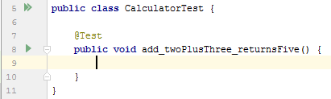
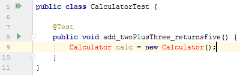
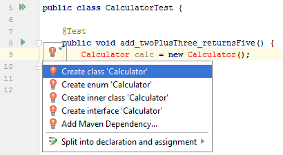
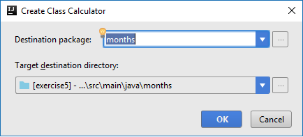
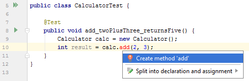
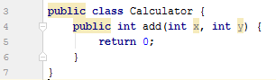
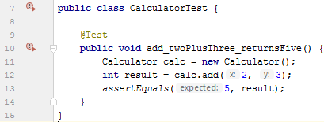
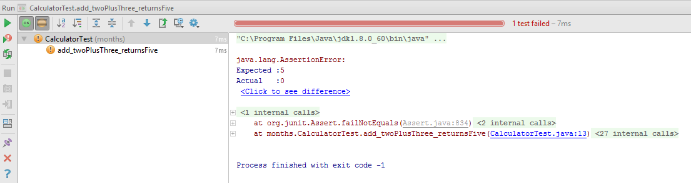
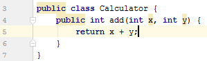
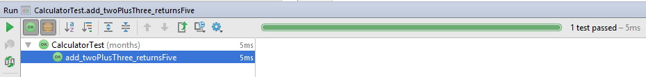

# Exercise 4 - Test Driven Development (TDD)

In this exercise we'll learn how to apply the TDD methodology when we're writing code.

## What is TDD

Test Driven Development is a way of writing code where we will **always** (a-l-w-a-y-s) write tests for our code
**before** we write the implementation code.

But wait! This means our code won't even compile, silly! Why yes. Yes it does.

So how does this makes sense?

## :book: How to do TDD

> :exclamation: This section contains a walkthrough of how to approach TDD. You should just read along, making sure you
> understand the workflow. You don't have to implement the calculator example yourself, the screenshots below are just for
> demonstration.

When following TDD, we always code in a certain pattern nicknamed "red-green-refactor".


### Red

First, we create a test.



Then, we start implementing the test based on how we plan the implementation to work.



Why not leverage the power of IntelliJ to help us out creating things as we go? Use `ALT+ENTER` or click the light-bulb.



Ensure it selects the correct package



Voila! The `Calculator.java` class and file has been created.

Let's continue in ``CalculatorTest.java``

I know I want an ``add`` function that takes two arguments and returns a value so I just start writing it so.

Again, there is no implementation, but I use ``ALT+ENTER`` to make IntelliJ create what I need.



I now have an ``Calculator`` class that looks like this without having to write anything myself.



Back in ``CalculatorTest`` I add the last line, then assert for the result.



I can finally run the test (``CTRL+SHIFT+F10`` when the cursor is on the test, or the icon in the gutter).

As expected, it fails because there is no actual implementation yet.



### Green

Now that we have a failing test, we can continue on to the next step - making it pass.

The only question you need to answer at this point: _what is the smallest amount of code I need to implement to make
this specific test pass?_

In the case of making the ``add()`` function work, it's quite simple



Run the test again, and it goes green!



### Refactor

Now that we have finished our test, we can refactor our code if necessary. Refactoring code just means to change
it's implementation details without changing it's behaviour. So we can change it, but our test should from now on always
pass.

For the simple example we're using in these examples there's not much refactoring to do.

### Repeat

Now that ``add()`` is implemented, we can add more features to our calculator in the same way:
Write the test, implement the feature, make the test pass, refactor.

## Tasks

Exercise 4 contains a skeleton for a simple ``RomanNumeralConverter`` class. It has one function: `String toRomanNumeral(int value)`
which given a number, returns a String representing that number in roman numerals. For instance, 3 should return "III",
and 9 should return "IX"; 

Here are the first 21 roman numerals

| Value | Symbol |
|-------|--------|
| 1     | I      |
| 2     | II     |
| 3     | III    |
| 4     | IV     |
| 5     | V      |
| 6     | VI     |
| 7     | VII    |
| 8     | VIII   |
| 9     | IX     |
| 10    | X      |
| 11    | XI     |
| 12    | XII    |
| 13    | XIII   |
| 14    | XIV    |
| 15    | IV     |
| 16    | XVI    |
| 17    | XVII   |
| 18    | XVIII  |
| 19    | XIX    |
| 20    | XX     |
| 21    | XXI    |


### Task 1

:pencil2: Open the `RomanNumeralTest` and run it. It should turn green

:pencil2: Add a test that checks if toRomanNumeral returns "II" if you pass it 2. You can copy and paste
the code below. Run the test, make sure it fails.

```java
@Test
void two_is_II() {
    RomanNumeralConverter converter = new RomanNumeralConverter();
    String romanNumeral = converter.toRomanNumeral(2);
    assertEquals("II", romanNumeral);
}
```

Once you have seen the test fail, add the simplest, most naive code you can in order to make the test pass (green).
You could for instance use an if-else statement that returns "I" if the value is 1, or "II" if the value is 2.

Don't worry, we'll refactor this later!

### Task 2
You may have recognized that our two tests are quite similar. If we continue to copy and paste the first test, 
only changing the input and expected output, there is going to be a bit of duplication. 

Move the `converter` variable out of each test and into the `RomanNumeralTest` class as an instance variable. 
Create a setup method annotated with `@BeforeEach` that initializes that variable. 

It could look something like this:

```java
package exercise4;

import org.junit.jupiter.api.BeforeEach;

public class RomanNumeralTest {
    RomanNumeralConverter converter;
    
    @BeforeEach 
    public void setUp() {
        // initialize the converter here
    }
    
    // Other test methods 
}
```

### Task 3
Add a test that checks if toRomanNumeral returns "III" if you pass it 3. Run the test, make sure it fails, 
and *then* implement the functionality in the most naive way possible. You could for instance continue to 
use if-else statements. Remember to run all the tests, so that you don't break the other two.

### Task 4
Now that you have implemented a bit of functionality, it's time to start thinking about refactoring. If you've
written the code as naively as we suggested, it might look a bit like this: 

```java 
public class RomanNumeralConverter {
    public String toRomanNumeral(int value) {
        if (value == 3) return "III";
        else if (value == 2) return "II";
        return "I";
    }
}
```

This clearly can't continue. We need a more general approach for the first three roman numerals. 

:exclamation: We are *not* adding more functionality in this step. We are simply going to make the implementation for 
the first three roman numerals more elegant.

One possible (very naive) algorithm for converting from decimal to roman numerals goes a little something like this: 

- let `result` be an empty string
- while `number > 0`
  - append `I` to `result`
  - subtract 1 from `number`
- return `result`

:pencil2: Refactor the code using the algorithm above. Do not expand to other numerals like "IV" now. Run the tests
frequently, making sure not to break them. 

### Task 5

It's finally time to add support for a few bigger numbers. It's a good idea to treat "I", "IV", "V", "IX" and "X" as
separate cases, since this allows us to expand the algorithm above. 

The modified algorithm could look something like this: 

- let `result` be an empty string
- while `number > 0`
  - if `number >= 4`
    - append `IV` to `result`
    - subtract 4 from `number`
  - else
    - append `I` to `result`
    - subtract 1 from `number`
- return `result`

:pencil2: Add a test that checks if toRomanNumeral returns "IV" if you pass it 4. Run all the tests, make sure 
the new test fails, and *then* implement the functionality according to the above algorithm. When all tests turn
green, you're done.

### Task 6

We're ready to tackle "V". In doing so, we'll create more duplication that we'll refactor afterwards. First, 
we'll simply expand our algorithm to handle "V" as a separate case. 

The modified algorithm could look something like this:

- let `result` be an empty string
- while `number > 0`
    - if `number >= 5`
        - append `V` to `result`
        - subtract 5 from `number`
    - else if `number >= 4`
        - append `IV` to `result`
        - subtract 4 from `number`
    - else
        - append `I` to `result`
        - subtract 1 from `number`
- return `result`

You may be starting to se a pattern here, but let's crack on the naive way for now, and refactor later. Note 
that we are starting with the biggest numeral we know, and working our way down. That's going to be important
when we refactor later.

:pencil2: Add a test that checks if toRomanNumeral returns "V" if you pass it 5. Run all the tests, make sure
the new test fails, and *then* implement the functionality according to the above algorithm. When all tests turn
green, you're done. 


### Task 7

If you've done everything correctly up until now, the code should correctly return "VI" if you pass it 6.
Write a test and try it out!

### Task 8

If you've made it this far, it's time to make this more elegant. While it works, the if-else-statements are going 
to be pretty long in order to support all the numerals I (1), IV (4), V (5), IX (9), X (10), XL (40), L (50), XC (90),
C (100), CD (400), D (500), CM (900), M (1000). What we want is to be able to list the numerals we support, and loop 
through them, appending symbols to the result as we go.

Start by refactoring the code you already have, without adding support for IX and X and so on yet. We suggest
the following algorithm: 

- let `result` be an empty string
- let `numerals` be a list of `RomanNumeral` instances representing the values (5, "V"), (4, "IV"), (1, "I")
- while `number > 0`
  - for `numeral` in `numerals`: 
    -  if `number >= numeral.value`
      - subtract `numeral.value` from `number`
      - append `numeral.symbol` to `result`
      - `break` out of for-loop
- return `result`


:pencil2: Without adding any tests, refactor the code according to the above algorithm. Run the tests 
frequently. 

:pencil2: When all the tests pass, add a test for "IX", make it fail, implement it, make sure all tests pass, and so on.

:pencil2: Add a test that checks that the code returns "MCMXCVII" if you pass it 1997.

### [Go to Bonus exercise 1 :arrow_right:](exercise-5.md)
